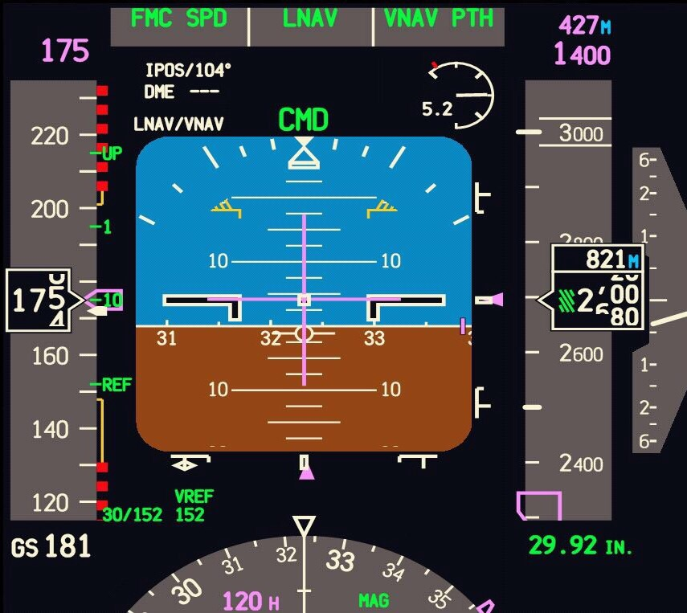

# Projeto Final de Sistemas Aviónicos Integrados

Esta pasta contém o projeto final da unidade curricular de Sistemas Aviónicos Integrados.

O objetivo deste projeto é desenhar um display simulado de um avião que consiga expor a altitude, velocidade no ar e atitude de um avião, emulando um *Primary Flight Display*. O nosso projeto utilizou como referência um *Primary Flight Display* de um Boeing 747, semelhante ao visível na imagem abaixo.

